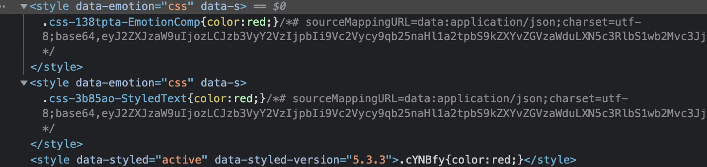
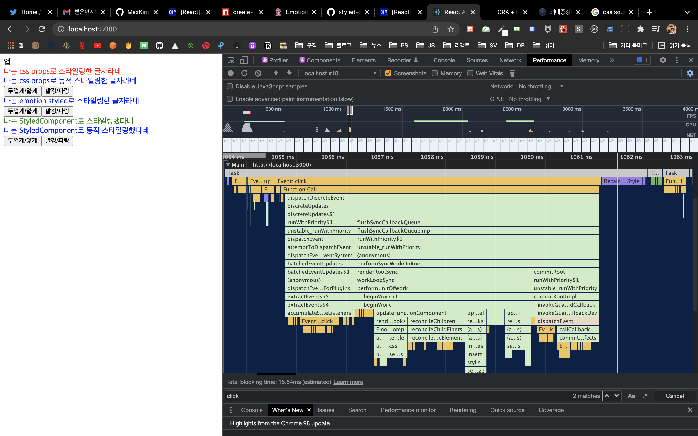
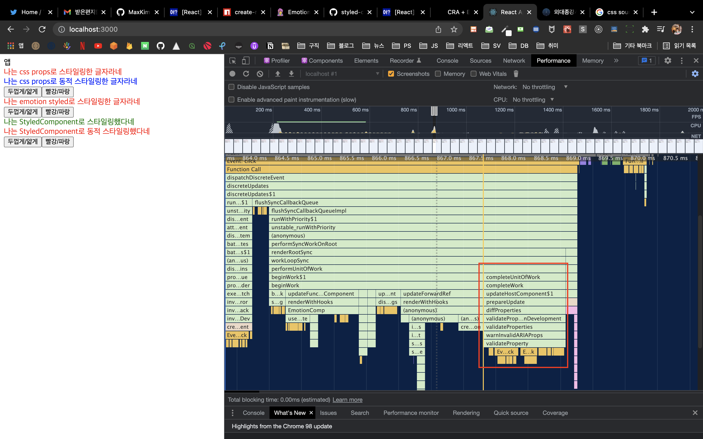
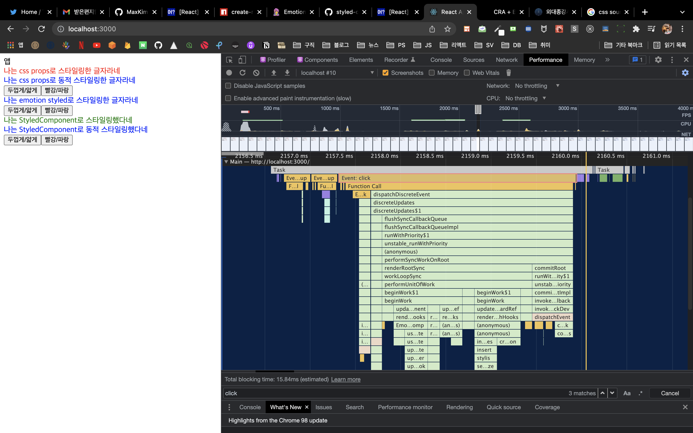
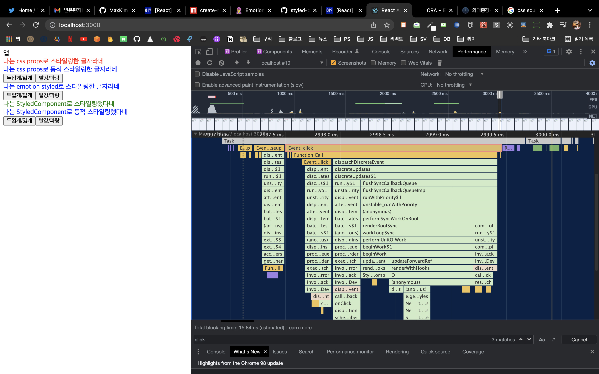

# 디자인 시스템 poc

음.. 디자인 시스템이라고 하면 말이 넘 거창한데, 그냥 프로젝트 안에서 스타일 어캐할지 실험해보는 것임  
emotion이랑 styled-components를 비교할것이고, styled와 css props도 한번 볼거임  
글로벌 스타일 어떻게 줄지, design token들은 어떻게 관리할지 생각도 해봄

## design token

## styled component vs emotion

### 데브 모드에서의 style

둘다 dev모드에서는 head 태그에 스타일시트를 넣는다. 생긴게 살짝 다름. emotion은 데브모드에서 해쉬한 클래스 이름에 적용한 스타일 요소 혹은 styled컴포넌트의 이름과 소스맵(이거 어따 써먹는걸까)까지 제공하는데, styled component는 그런거 없고 그냥 해쉬한 클래스값만 뱉는다.

prod 모드에서는 CSSOM을 직접 건드리는 방식으로 동작한다고 한다.

그리고 emotion은 동적 스타일을 새롭게 처리할때마다 style 태그를 계속 추가하고 없애지 않는다. styled-components는 하나의 style 태그에 때려박는다. 

### 동적 요소 스타일링

#### css props vs styled

- emotion이나 styled-components를 쓰나 인터페이스는 그냥 동일하다. 컴포넌트 만들어줘야 되고, prop필요할 경우 타입선언도 해줘야함
- cssprops는 그에비해 그냥 함수다

#### 성능

당연히 단순한 비교는 어려울 것이겠고, 앱이 아주 복잡해기지 전까지는 앱 성능 전반에 크나큰 영향을 주지는 않을...거라고 생각하지만 대충 동적 스타일 토글하면 무슨 일들이 일어나는지 파악해보자

emotion css props - 8ms정도, 제일 길다

styled와 다른 일이 추가로 일어나고 그게 약간 병목?이 되는거 같은데 그거는 이부분이다. 그리고 밑에 code compile가 짧은 시간에 여러번 일어난다. 

새로운 스타일을 만들어낼 때 diffing 비용을 지불하는 듯한 느낌적인 느낌이다. compile code가 여러번 일어나는게 찝찝하고... 확실히 styled가 더 성능이 좋다.

흠.. 인터페이스가 좀더 편리하다고 생각해서 종강시계에는 사용했었음. 원래의 html 태그를 가리지 않는 방식으로 스타일링이 가능하고, 함수를 통해 새로 컴포넌트를 만들어내는 것보다는 간단히 스타일링을 할 수 있을거라고 생각했는데...

나중에 종강시계에 zero runtime에 가까운 css-in-js로 리팩토링해야겠다 싶긴 하다.

emotion styled - 4ms정도

styled류는 compile code가 1~2번밖에 일어나지 않았다. 뭔가 styled컴포넌트는 스타일을 적용하는 방식이 [HOC의 그것과 흡사](https://github.com/styled-components/styled-components/blob/main/packages/styled-components/src/models/StyledComponent.ts)하기 때문에 컴파일을 다시 할 필요 없이 그냥 컴포넌트 재랜더링 정도만 하면 되서 그런건가 싶기도. 잘은 모르겠지만 확실히 매커니즘적인 차이가 존재할것 같다.

styled component - 4ms정도

인터페이스가 살짝 아쉽긴 하지만, styled 써야겠다! 

## global style

## 동적 요소 스타일링

## theme
